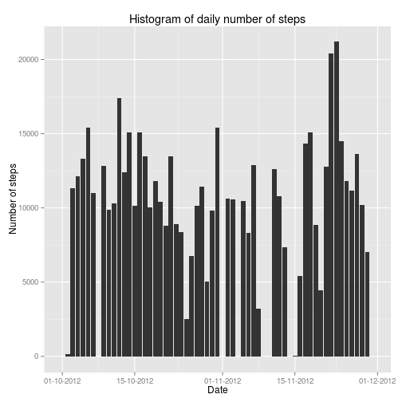
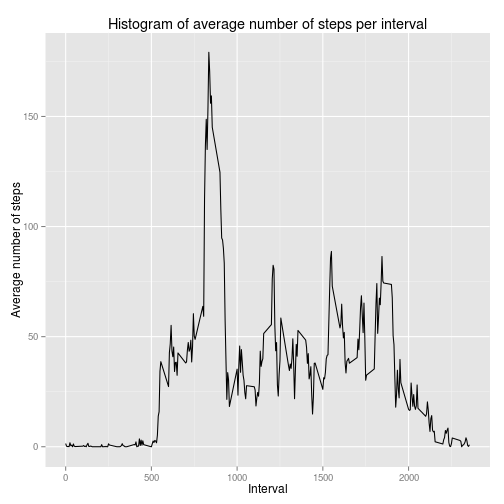
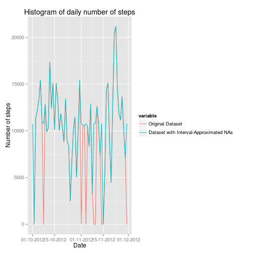
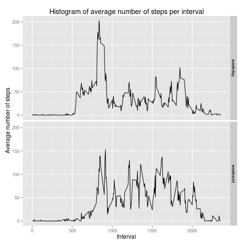

## Loading and preprocessing the data


```r
library(lubridate)
activity <- read.csv("activity.csv", stringsAsFactors=FALSE)
# Converting the dates.
activity$date <- as.Date(activity$date, "%Y-%m-%d")
```
## What is mean total number of steps taken per day?
Histogram of daily number of steps:

```r
library(plyr)
library(ggplot2)
library(scales)
# Removing the missing values from the set.
activity_with_nas_replaced_with_zeros <- activity
activity_with_nas_replaced_with_zeros$steps[is.na(activity_with_nas_replaced_with_zeros$steps)] <- 0
daily_sum_of_steps <- aggregate(activity_with_nas_replaced_with_zeros$steps, by=list(activity_with_nas_replaced_with_zeros$date), FUN=sum)
daily_sum_of_steps_plot <- ggplot(daily_sum_of_steps, aes(x=Group.1, y=x)) + geom_bar(binwidth=1, stat="identity") + scale_x_date(labels = date_format("%d-%m-%Y")) + xlab("Date") + ylab("Number of steps") + labs(title="Histogram of daily number of steps")
print(daily_sum_of_steps_plot)
```

 

Mean total number of steps taken per day is $9354.2295082$, whereas the median of total number of steps taken per day is $1.0395 &times; 10<sup>4</sup>$.

## What is the average daily activity pattern?
To make sure that the daily averages are correct, I replace the NA values with zeros.

```r
avg_steps <- ddply(activity_with_nas_replaced_with_zeros,~interval, summarize, avg=mean(steps))
avg_steps_plot <- ggplot(data=avg_steps, aes(x=interval, y=avg)) + geom_line() + xlab("Interval") + ylab("Average number of steps") + labs(title="Histogram of average number of steps per interval")
print(avg_steps_plot)
```

 

The 5-minute interval with the highest average number of steps is interval 835 with the average of 179.1311475 steps.

## Imputing missing values

The original dataset contains 2304 rows with missing values, out of 17568 rows in total.
To approximate the missing values of steps, I have decided to take an average number of steps in the that interval in the whole data set. It seems that per-interval approximation is better than per-day one as some of the days don't have any data points whatsoever.

```r
library(reshape2)
avg_steps <- ddply(activity_without_nas,~interval, summarize, avg=mean(steps))
# Joining the estimated average steps with original data by interval.
activity_with_avg_steps <- merge(x=activity, y=avg_steps, by="interval", all=TRUE)
# Replacing the NAs with averages.
activity_with_avg_steps$steps[which(is.na(activity_with_avg_steps$steps))] <- activity_with_avg_steps$avg[which(is.na(activity_with_avg_steps$steps))]
# Merging the original and approximated datasets.
merged_activity <- merge(x=activity_with_nas_replaced_with_zeros, y=activity_with_avg_steps, by=c("date", "interval"), all=TRUE)
names(merged_activity) <- c("Date", "Interval", "Original Dataset", "Dataset with Interval-Approximated NAs", "Average")
merged_activity <- subset(merged_activity, select=c("Date", "Original Dataset", "Dataset with Interval-Approximated NAs"))
# Aggregating by day.
daily_sum_of_steps <- aggregate(. ~ Date, data=merged_activity, sum)
daily_sum_of_steps_melted <- melt(daily_sum_of_steps, id=c("Date"))
dataset_comparison_plots <- ggplot() + geom_line(data=daily_sum_of_steps_melted, aes(x=Date, y=value, color=variable)) + scale_x_date(labels = date_format("%d-%m-%Y")) + xlab("Date") + ylab("Number of steps") + labs(title="Histogram of daily number of steps")
print(dataset_comparison_plots)
```

 


In the original data set, mean total number of steps taken per day is $9354.2295082$, whereas the median of total number of steps taken per day is $1.0395 &times; 10<sup>4</sup>$. 

In the modified data set, with approximated missing values, mean total number of steps taken per day is $1.0766189 &times; 10<sup>4</sup>$, whereas the median of total number of steps taken per day is $1.0766189 &times; 10<sup>4</sup>$.

Clearly, imputing missing data overestimates the statistics in the set.

## Are there differences in activity patterns between weekdays and weekends?
To make sure that the daily averages are correct, I replace the NA values with zeros.

```r
activity_with_nas_replaced_with_zeros <- activity
activity_with_nas_replaced_with_zeros$steps[is.na(activity_with_nas_replaced_with_zeros$steps)] <- 0
activity_with_nas_replaced_with_zeros <- transform(activity_with_nas_replaced_with_zeros, day.Type = "weekday")
activity_with_nas_replaced_with_zeros <- transform(activity_with_nas_replaced_with_zeros, weekday = weekdays(date))
levels(activity_with_nas_replaced_with_zeros$day.Type) <- c(levels(activity_with_nas_replaced_with_zeros$day.Type), "weekend")
# Yeah, using Polish as the locale...
activity_with_nas_replaced_with_zeros[activity_with_nas_replaced_with_zeros$weekday %in% c("sobota", "niedziela"), 4] <- "weekend"

avg_steps <- ddply(activity_with_nas_replaced_with_zeros,~interval+day.Type, summarize, avg=mean(steps))
avg_steps_plot <- ggplot(data=avg_steps, aes(x=interval, y=avg)) + geom_line() + xlab("Interval") + ylab("Average number of steps") + labs(title="Histogram of average number of steps per interval") + facet_grid(day.Type~.)
print(avg_steps_plot)
```

 

